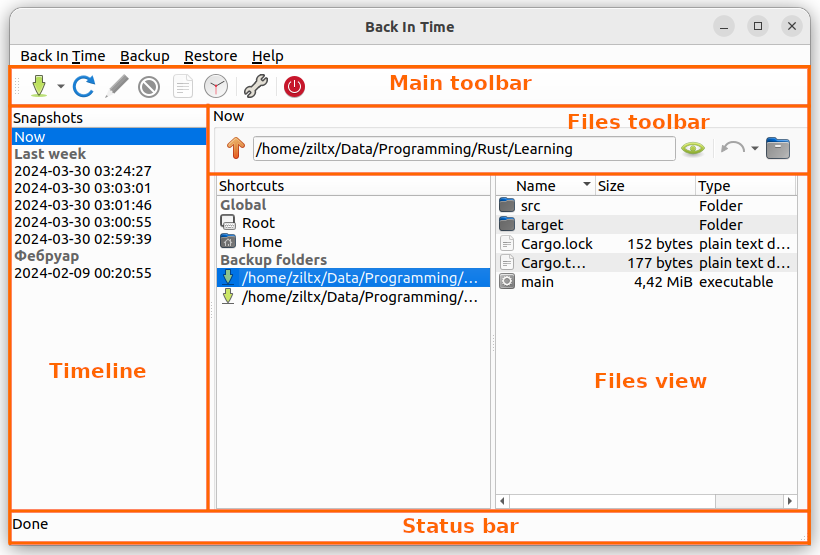

Main Window
===========

Overview
--------

<!-- 
 -->

Main Toolbar
------------

\_snapshot" /> Take Snapshot

:   Take a new Snapshot in background. The main window can be closed during taking the snapshot. Normal behavior is to only compare files size and modification time. Alternatively, you can take a new Snapshot with `checksums` option enabled. This will calculate checksums for every file to decide if the file has changed. Taking a snapshot with checksums option takes a lot more time but it will make sure, the destination files won\'t be corrupt.

\_snapshot" /> Refresh Snapshots List

:   Refresh the Snapshots in [Timeline](#timeline).

\_name" /> Snapshot Name

:   Add a name for a Snapshot so you can easily identify it later. If `Don't remove named snapshots` in **Settings \--\> Auto Remove** is enabled this will also prevent the Snapshot from being removed.

    If this button is grayed out you need to select a snapshot in[Timeline](#timeline).

\_snapshot" /> Remove Snapshot

:   Remove one or more Snapshots from Timeline. `Now` can not be removed as this is no Snapshot but the live view of the local file-system.

    If this button is grayed out you need to select a snapshot in[Timeline](#timeline).

\_snapshot\_log" /> View Snapshot Log

:   View the log of the selected Snapshot.

    If this button is grayed out you need to select a snapshot in[Timeline](#timeline).

\_last\_log" /> View Last Log

:   View the log from the last snapshot attempt.

 Settings

:   Open `/settings`{.interpreted-text role="doc"}.

 Shutdown System after Snapshot has finished

:   Shutdown the computer and poweroff after a snapshot has finished. The main window must stay open for this. If shutdown is not supported on the system this button will be grayed out.

 Exit

:   Close the main window. Running Snapshots will remain in background.

 Help

:   Menu with links to this help, FAQ, report bugs\...

Files Toolbar
-------------

 Up

:   Go to the parent folder.

\_hidden" /> Show hidden files

:   Toggle hidden files (starting with a dot) to be shown in files view.

 Restore

:   Restore selected files or folders. This button has a sub-menu (hold down the button). Default action is `Restore`.

    If this button is grayed out you need to select a snapshot in[Timeline](#timeline).

     Restore

    :   Restore the selected files or folders to the original destination.

    \_to" /> Restore to\...

    :   Restore the selected files or folders to a new destination.

     Restore \'/path\'

    :   Restore the currently shown folder and all its content to the original destination.

    \_to" /> Restore \'/path\' to\...

    :   Restore the currently shown folder and all its content to a new destination.

 Snapshots

:   Open `/snapshotsdialog`{.interpreted-text role="doc"}.

Timeline
--------

The Timeline lists all Snapshots which where already taken. You can browse them to see its contents in right hand [Files View](#files-view). The first item `Now` is not a Snapshot. It is a live view on the local file-system. It shows exact the same as your normal file browser. Multi selection is possible to remove multiple Snapshots altogether.

Files View
----------

Depending on selection in left hand [Timeline](#timeline) this will either show the original files or the files in the selected snapshot. You can jump directly to your home or include folders in `Shortcuts`.

Statusbar
---------

Show current status. While a snapshot is running this will show a progress-bar combined with current speed, already transfered data and the last message from `rsync`.
